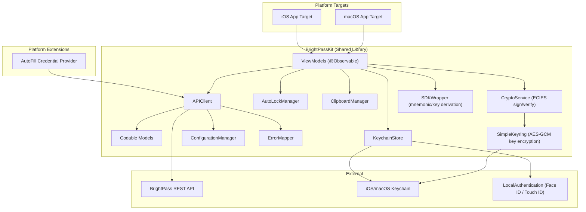
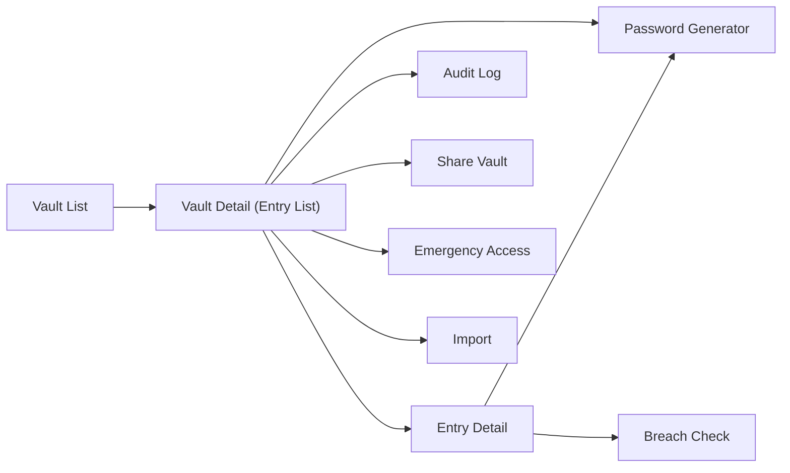
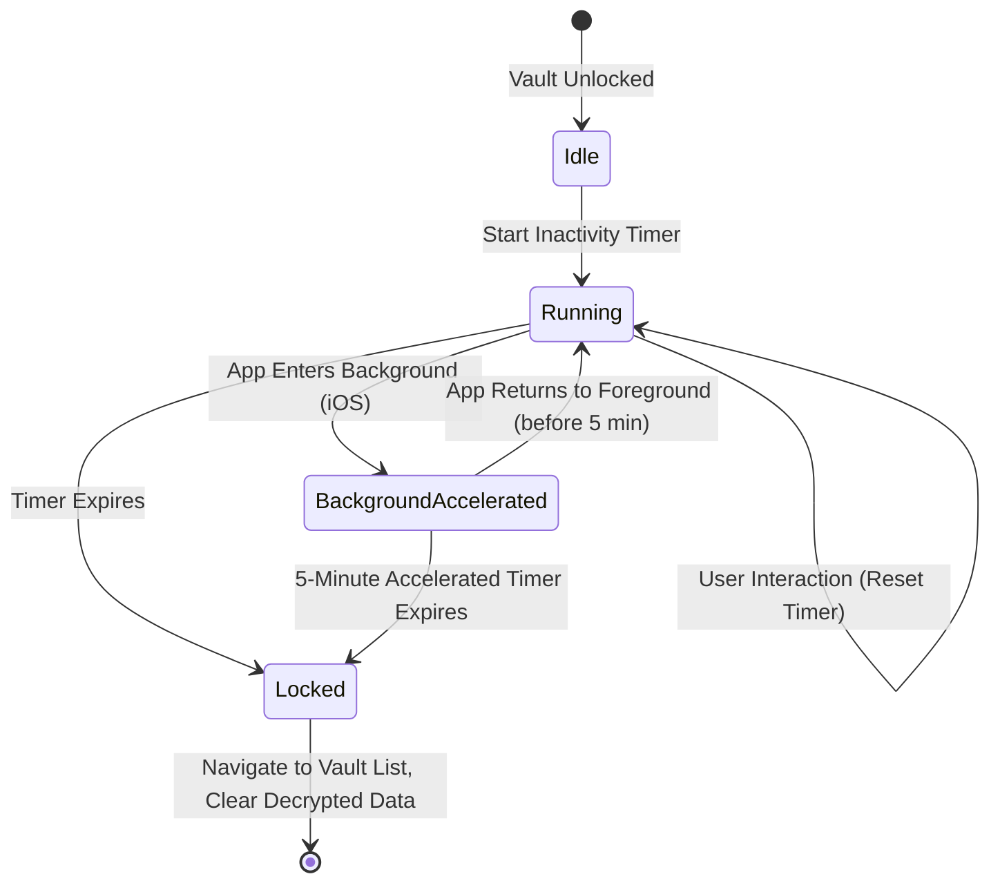
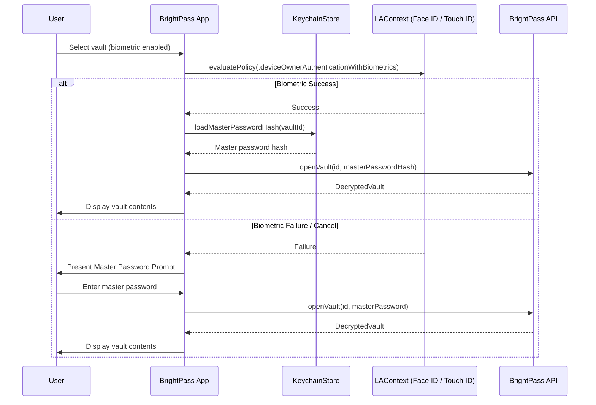
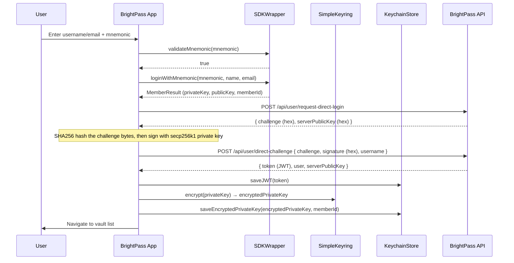
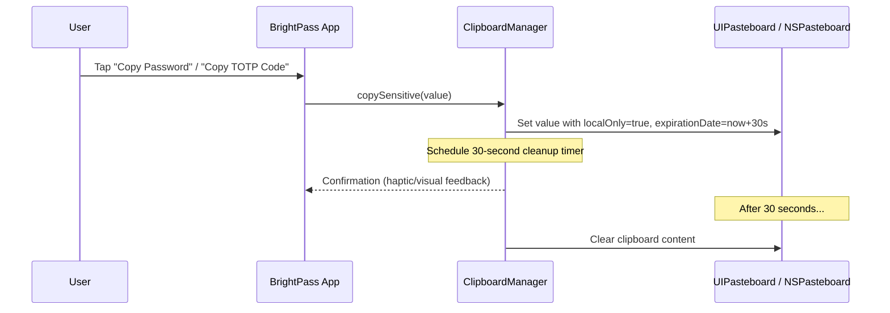
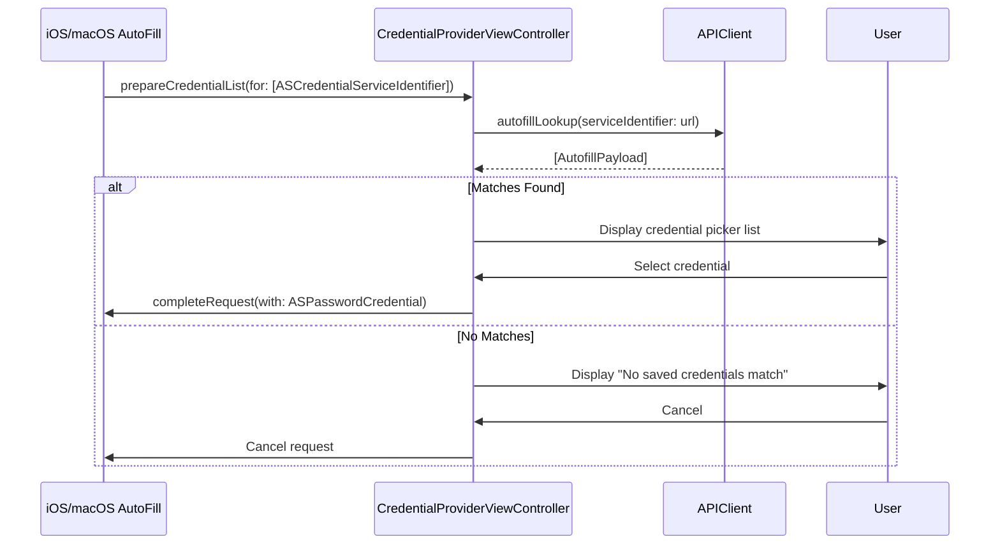

# Design Document: BrightPass Apple UI

## Overview

BrightPass Apple UI is a native SwiftUI password management application targeting iOS 17+ and macOS 13+. The application is structured as a Swift Package with a shared library (`BrightPassKit`) containing all API communication, data models, and state management, and separate platform-specific app targets for iOS and macOS.

The app communicates exclusively with the BrightPass REST API backend — it performs no local encryption or storage of vault data beyond JWT tokens and optional biometric-protected master password hashes in the Keychain. The VCBL (Vault Constituent Block List) architecture enables fast vault listing via lightweight `EntryPropertyRecord` metadata, with full entry decryption happening lazily on demand through the API.

### Key Design Decisions

1. **API-first architecture**: All vault operations, password generation, TOTP, breach checking, and import are delegated to the REST API. The client is a thin presentation layer.
2. **Shared library via Swift Package**: `BrightPassKit` contains all non-UI code (API client, models, state management). iOS and macOS targets only contain SwiftUI views and platform-specific adaptations.
3. **Async/await networking**: All API calls use Swift concurrency (`async`/`await`) with structured task cancellation.
4. **Observable state management**: `@Observable` macro (iOS 17+/macOS 14+) for view models, with `@ObservationIgnored` for non-UI state.
5. **Keychain for secrets**: JWT tokens, encrypted private keys, and biometric-protected master password hashes stored via the iOS/macOS Keychain with appropriate access control policies.
6. **ECIES Direct Challenge authentication**: Primary auth flow uses mnemonic-derived secp256k1 keys to sign a server challenge (two-step passwordless login). The existing `SDKWrapperProtocol` and `SimpleKeyring` from brightchain-apple provide mnemonic validation, key derivation, and private key encryption.
7. **Auto-lock via inactivity timer**: A centralized `AutoLockManager` monitors user interaction and app lifecycle events to lock vaults after configurable inactivity.
8. **Clipboard expiration**: Sensitive data copied to the clipboard is marked `localOnly` with a 30-second expiration to prevent leakage via clipboard history.


## Architecture



### Layered Architecture

The application follows a three-layer architecture:

1. **View Layer** (Platform-specific): SwiftUI views using `NavigationSplitView` on macOS and `NavigationStack` on iOS. Views observe `@Observable` view models and dispatch user actions.
2. **ViewModel Layer** (BrightPassKit): `@Observable` classes that manage UI state, coordinate API calls, and handle business logic like auto-lock timers and clipboard expiration.
3. **Service Layer** (BrightPassKit): `APIClient` for networking, `KeychainStore` for secure storage, `ConfigurationManager` for environment configuration, `ErrorMapper` for translating API/network errors into user-facing messages.

### Navigation Architecture



The `NavigationRouter` manages a three-level hierarchy: vault list → vault detail → entry detail. On macOS, this maps to a `NavigationSplitView` with sidebar/content/detail columns. On iOS, it uses a `NavigationStack` with push/pop transitions. When a vault is locked (manually or by timeout), the router resets to the vault list view.

### Auto-Lock Timer Flow



The `AutoLockManager` is an `@Observable` class injected into the view model layer. It:
- Maintains a configurable `timeoutMinutes` (default 15, range 1–60).
- Resets its internal `Timer` on every user interaction event (tap, scroll, keyboard input) via a `resetTimer()` call from the view layer.
- On iOS, observes `UIApplication.didEnterBackgroundNotification` to start an accelerated 5-minute timer, and `willEnterForegroundNotification` to cancel it and resume the standard timer.
- When the timer fires, it sets `isLocked = true`, which triggers the `VaultDetailViewModel` to call `lockVault()` — clearing all decrypted entries, property records, and master password hashes from memory — and the `NavigationRouter` to reset to the vault list.

### Biometric Unlock Flow



When biometric unlock is enabled for a vault:
1. The `KeychainStore` saves the master password hash with `SecAccessControlCreateWithFlags` using `.biometryCurrentSet` — requiring the current enrolled biometric to access the item.
2. On vault open, the `VaultDetailViewModel` checks if biometric is enabled for the vault and calls `LAContext.evaluatePolicy(.deviceOwnerAuthenticationWithBiometrics)`.
3. On success, it retrieves the stored hash from the Keychain and uses it to open the vault via the API.
4. On failure (user cancels, biometric not recognized, biometric not enrolled), it falls back to the standard `MasterPasswordPromptView`.
5. When the user disables biometric for a vault, `KeychainStore.deleteMasterPasswordHash(vaultId:)` removes the Keychain item.

### Clipboard and Sensitive Data Handling

The `ClipboardManager` handles all sensitive copy operations:

### ECIES Direct Challenge Authentication Flow

The primary authentication method uses the ECIES direct challenge flow — a two-step passwordless login using the member's mnemonic-derived secp256k1 key pair. This leverages the existing `SDKWrapperProtocol` and `SimpleKeyring` from the brightchain-apple package.



**Challenge buffer layout (from server):**

| Offset | Length | Content |
|--------|--------|---------|
| 0 | 8 bytes | Timestamp (big-endian uint64, milliseconds) |
| 8 | 32 bytes | Random nonce |
| 40 | 64 bytes | Server ECIES signature over `timestamp ‖ nonce` |

**Signing process (client-side):**
1. Hex-decode the challenge string to raw bytes
2. SHA256 hash the challenge bytes
3. Sign the hash with the member's secp256k1 private key (deterministic RFC 6979 signatures, 64-byte compact `[r(32) | s(32)]`)
4. Hex-encode the signature for the API request

The `SDKWrapperProtocol` (from brightchain-apple) provides:
- `validateMnemonic(_:)` — validates 12 BIP39 words
- `loginWithMnemonic(_:name:email:)` → `MemberResult` with `privateKey` (32 bytes), `publicKey` (33 bytes compressed), `memberId`
- `signData(_:withPrivateKey:)` → 64-byte ECDSA signature

The `SimpleKeyring` (from brightchain-apple) provides AES-GCM encryption of the private key using a Keychain-stored symmetric key, so the mnemonic doesn't need to be re-entered for subsequent signing operations.

### Clipboard and Sensitive Data Handling

The `ClipboardManager` handles all sensitive copy operations:



Platform-specific behavior:
- **iOS**: Uses `UIPasteboard.general.setItems([...], options: [.localOnly: true, .expirationDate: Date().addingTimeInterval(30)])`. The system automatically clears the item after 30 seconds and prevents it from syncing via Universal Clipboard.
- **macOS**: Uses `NSPasteboard.general` with a scheduled `DispatchSourceTimer` that clears the pasteboard after 30 seconds. Since macOS doesn't have built-in expiration, the timer is the cleanup mechanism.

Password fields in entry detail views default to masked display (`•••••••••`) with a toggle button (eye icon) to reveal the plaintext value. The `isPasswordVisible` state on `EntryDetailViewModel` controls this.

### Autofill Credential Provider Extension

The AutoFill extension is a separate target that implements `ASCredentialProviderViewController`:



The extension:
1. Registers via the `com.apple.authentication-services-credential-provider-extension` entitlement.
2. Receives service identifiers (URLs) from the system when a login form is detected.
3. Uses `APIClient` to query the BrightPass API for matching login entries.
4. Presents a minimal SwiftUI list of matching credentials (title + username).
5. On selection, provides `ASPasswordCredential(user:, password:)` back to the system.
6. If no matches, displays a message and allows the user to cancel.
7. The extension shares the Keychain access group with the main app to read the JWT token.


## Components and Interfaces

### Service Layer (BrightPassKit)

#### APIClient

The central networking component. All methods are `async throws`.

```swift
protocol APIClientProtocol {
    // Auth — ECIES Direct Challenge (primary flow)
    func requestDirectLogin() async throws -> DirectLoginChallenge
    func submitDirectChallenge(challenge: String, signature: String, username: String) async throws -> DirectChallengeResponse
    func refreshToken() async throws -> DirectChallengeResponse
    func logout() async throws
    func verifyToken() async throws -> UserProfile
    
    // Auth — Password-based (fallback, not yet working on server)
    func login(username: String, password: String) async throws -> AuthResponse
    func register(username: String, email: String, password: String) async throws -> AuthResponse
    
    // Vaults
    func listVaults() async throws -> [VaultMetadata]
    func createVault(name: String, masterPassword: String) async throws -> VaultMetadata
    func openVault(id: String, masterPassword: String) async throws -> DecryptedVault
    func deleteVault(id: String) async throws
    
    // Entries
    func listEntries(vaultId: String) async throws -> [EntryPropertyRecord]
    func getEntry(vaultId: String, entryId: String) async throws -> VaultEntry
    func createEntry(vaultId: String, entry: VaultEntry) async throws -> VaultEntry
    func updateEntry(vaultId: String, entryId: String, entry: VaultEntry) async throws -> VaultEntry
    func deleteEntry(vaultId: String, entryId: String) async throws
    func searchEntries(vaultId: String, query: String) async throws -> [EntryPropertyRecord]
    
    // Password Generation
    func generatePassword(options: PasswordOptions) async throws -> GeneratedPassword
    
    // TOTP
    func generateTOTP(secret: String) async throws -> TotpCode
    func validateTOTPSecret(secret: String) async throws -> TotpCode
    
    // Breach Check
    func checkBreach(password: String) async throws -> BreachCheckResult
    
    // Autofill
    func autofillLookup(serviceIdentifier: String) async throws -> [AutofillPayload]
    
    // Audit Log
    func getAuditLog(vaultId: String) async throws -> [AuditLogEntry]
    
    // Sharing
    func shareVault(vaultId: String, memberId: String, permission: SharePermission) async throws
    func revokeShare(vaultId: String, memberId: String) async throws
    func listSharedMembers(vaultId: String) async throws -> [SharedMember]
    
    // Emergency Access
    func configureEmergencyAccess(vaultId: String, config: EmergencyAccessConfig) async throws
    func getEmergencyAccessConfig(vaultId: String) async throws -> EmergencyAccessConfig
    func recoverVault(vaultId: String, shares: [String]) async throws -> DecryptedVault
    
    // Import
    func importEntries(vaultId: String, source: ImportSource, fileData: Data) async throws -> ImportResult
    
    // Vault Rename
    func renameVault(id: String, name: String) async throws -> VaultMetadata
    
    // Master Password Change
    func changeMasterPassword(vaultId: String, currentPassword: String, newPassword: String) async throws
    
    // Export
    func exportEntries(vaultId: String, format: ExportFormat) async throws -> Data
}
```

The concrete `APIClient` class:
- Holds a `URLSession` and base URL from `ConfigurationManager`
- All endpoints are prefixed with the appropriate API path (e.g., `/api/user` for auth, vault-specific paths for vault operations)
- Reads the JWT from `KeychainStore` and attaches it as a Bearer token to every request's `Authorization` header
- On 401 responses, clears the JWT via `KeychainStore.deleteJWT()` and posts a `.sessionExpired` notification
- Uses a shared `JSONDecoder` with `.iso8601` date strategy
- Maps non-2xx responses to `APIError` with status, code, message, and details via `ErrorMapper`

#### KeychainStore

```swift
protocol KeychainStoreProtocol {
    func saveJWT(_ token: String) throws
    func loadJWT() throws -> String?
    func deleteJWT() throws
    func saveMasterPasswordHash(_ hash: String, vaultId: String, biometricProtected: Bool) throws
    func loadMasterPasswordHash(vaultId: String) throws -> String?
    func deleteMasterPasswordHash(vaultId: String) throws
    func hasBiometricProtectedHash(vaultId: String) throws -> Bool
    // ECIES key storage for direct challenge auth
    func saveEncryptedPrivateKey(_ data: Data, memberId: String) throws
    func loadEncryptedPrivateKey(memberId: String) throws -> Data?
    func deleteEncryptedPrivateKey(memberId: String) throws
}
```

Uses Security framework's `SecItemAdd`/`SecItemCopyMatching`/`SecItemDelete`. Biometric-protected items use `SecAccessControlCreateWithFlags` with `.biometryCurrentSet`. The Keychain access group is shared between the main app and the AutoFill extension.

#### SDKWrapperProtocol and CryptoService

Ported from the existing brightchain-apple package (`BrightChainCore`). These provide the cryptographic primitives needed for the ECIES direct challenge flow.

```swift
/// Protocol for BrightChain SDK operations (mnemonic and key management)
/// Ported from brightchain-apple/Sources/BrightChainCore/Protocols/SDKWrapperProtocol.swift
protocol SDKWrapperProtocol {
    func validateMnemonic(_ mnemonic: String) -> Bool
    func generateMnemonic() -> String
    func loginWithMnemonic(_ mnemonic: String, name: String, email: String) -> MemberResult?
    func createMemberWithMnemonic(_ mnemonic: String, name: String, email: String) -> MemberResult?
    func signData(_ data: Data, withPrivateKey privateKey: Data) -> Data?
    func verifySignature(_ signature: Data, forData data: Data, withPublicKey publicKey: Data) -> Bool
}

struct MemberResult {
    let id: String
    let publicKey: Data   // 33 bytes, compressed secp256k1
    let privateKey: Data  // 32 bytes
    let name: String
    let email: String
}
```

The `FallbackSDKWrapper` (pure Swift, from brightchain-apple) uses P256 for iOS. For production secp256k1 compatibility, the C++ bridge or a Swift secp256k1 library would be used.

```swift
/// Protocol for secure key encryption/decryption
/// Ported from brightchain-apple/Sources/BrightChainCore/Protocols/KeyringProtocol.swift
protocol KeyringProtocol {
    func encrypt(data: Data) throws -> Data
    func decrypt(encryptedData: Data) throws -> Data
    func deleteKey() throws
    func hasKey() -> Bool
}
```

The `SimpleKeyring` implementation uses AES-GCM with a 256-bit symmetric key stored in the Keychain (`kSecAttrAccessibleAfterFirstUnlock`).

#### Direct Challenge Auth Models

```swift
/// Response from POST /api/user/request-direct-login
struct DirectLoginChallenge: Codable, Equatable {
    let challenge: String      // hex-encoded challenge buffer (104 bytes decoded)
    let message: String
    let serverPublicKey: String // hex-encoded server public key
}

/// Response from POST /api/user/direct-challenge
struct DirectChallengeResponse: Codable, Equatable {
    let message: String
    let user: UserProfile
    let token: String          // JWT (7-day expiry)
    let serverPublicKey: String
}

/// User profile from auth responses
struct UserProfile: Codable, Equatable {
    let id: String
    let username: String
    let email: String
    let roles: [String]
    let emailVerified: Bool
    let timezone: String
    let siteLanguage: String
    let darkMode: Bool
    let currency: String
    let directChallenge: Bool
    let lastLogin: String?
}

/// Response from POST /api/user/register and POST /api/user/login
struct AuthResponse: Codable, Equatable {
    let message: String
    let data: AuthResponseData
}

struct AuthResponseData: Codable, Equatable {
    let token: String
    let memberId: String
    let energyBalance: Int
}
```

#### ConfigurationManager

```swift
@Observable
class ConfigurationManager {
    var baseURL: URL
    
    init(environment: Environment = .production) {
        switch environment {
        case .development: baseURL = URL(string: "http://localhost:8080")!
        case .production: baseURL = URL(string: "https://brightchain.org")!
        }
    }
    
    enum Environment { case development, production }
}
```

#### ErrorMapper

```swift
struct ErrorMapper {
    /// Maps URLSession errors and HTTP responses to user-facing AppError values.
    static func map(_ error: Error) -> AppError {
        switch error {
        case let urlError as URLError:
            return mapNetworkError(urlError)
        case let apiError as APIError:
            return mapAPIError(apiError)
        case let decodingError as DecodingError:
            return .decodingFailure(detail: decodingError.localizedDescription)
        default:
            return .unknown(underlying: error)
        }
    }
    
    private static func mapNetworkError(_ error: URLError) -> AppError {
        switch error.code {
        case .timedOut, .notConnectedToInternet, .networkConnectionLost:
            return .networkUnavailable(message: "Network is unavailable. Check your connection and try again.")
        default:
            return .networkUnavailable(message: "A network error occurred. Please try again.")
        }
    }
    
    private static func mapAPIError(_ error: APIError) -> AppError {
        switch error.status {
        case 401:
            return .sessionExpired
        case 400..<500:
            return .validationError(messages: error.details ?? [error.message])
        case 500..<600:
            return .serverError(message: "A server error occurred. Please try again later.")
        default:
            return .unknown(underlying: error)
        }
    }
}

enum AppError: Error, Equatable {
    case networkUnavailable(message: String)
    case sessionExpired
    case validationError(messages: [String])
    case serverError(message: String)
    case decodingFailure(detail: String)
    case unknown(underlying: Error)
    
    var isRetryable: Bool {
        switch self {
        case .networkUnavailable, .serverError: return true
        case .sessionExpired, .validationError, .decodingFailure, .unknown: return false
        }
    }
    
    var userMessage: String {
        switch self {
        case .networkUnavailable(let msg): return msg
        case .sessionExpired: return "Your session has expired. Please log in again."
        case .validationError(let msgs): return msgs.joined(separator: "\n")
        case .serverError(let msg): return msg
        case .decodingFailure(let detail): return "Failed to process server response: \(detail)"
        case .unknown: return "An unexpected error occurred."
        }
    }
    
    static func == (lhs: AppError, rhs: AppError) -> Bool {
        switch (lhs, rhs) {
        case (.networkUnavailable(let a), .networkUnavailable(let b)): return a == b
        case (.sessionExpired, .sessionExpired): return true
        case (.validationError(let a), .validationError(let b)): return a == b
        case (.serverError(let a), .serverError(let b)): return a == b
        case (.decodingFailure(let a), .decodingFailure(let b)): return a == b
        default: return false
        }
    }
}
```


### ViewModel Layer (BrightPassKit)

#### VaultListViewModel

```swift
@Observable
class VaultListViewModel {
    var vaults: [VaultMetadata] = []
    var isLoading: Bool = false
    var error: AppError?
    
    func loadVaults() async
    func createVault(name: String, masterPassword: String) async
    func deleteVault(_ vault: VaultMetadata) async
}
```

On successful `createVault`, appends the new `VaultMetadata` to `vaults` without a full refresh. On successful `deleteVault`, removes the vault from `vaults` by ID.

#### VaultDetailViewModel

```swift
@Observable
class VaultDetailViewModel {
    var vault: DecryptedVault?
    var entries: [EntryPropertyRecord] = []
    var searchQuery: String = ""
    var typeFilter: EntryType?
    var favoritesOnly: Bool = false
    var isLoading: Bool = false
    var error: AppError?
    
    func openVault(id: String, masterPassword: String) async
    func openVaultBiometric(id: String) async
    func searchEntries() async
    func filterEntries() -> [EntryPropertyRecord]
    func deleteEntry(_ entry: EntryPropertyRecord) async
    func lockVault()
    func refreshEntries() async
}
```

`filterEntries()` applies local filters on the `entries` array:
- If `typeFilter` is set, only entries matching that type are included.
- If `favoritesOnly` is true, only entries with `isFavorite == true` are included.
- Both filters compose (AND logic).

`lockVault()` clears `vault`, `entries`, `searchQuery`, and all filter state, setting everything to nil/empty/default.

#### EntryDetailViewModel

```swift
@Observable
class EntryDetailViewModel {
    var entry: VaultEntry?
    var isEditing: Bool = false
    var isPasswordVisible: Bool = false
    var isLoading: Bool = false
    var error: AppError?
    
    func loadEntry(vaultId: String, entryId: String) async
    func saveEntry(vaultId: String) async
    func deleteEntry(vaultId: String) async
}
```

#### PasswordGeneratorViewModel

```swift
@Observable
class PasswordGeneratorViewModel {
    var length: Int = 20
    var includeUppercase: Bool = true
    var includeLowercase: Bool = true
    var includeDigits: Bool = true
    var includeSpecial: Bool = true
    var minUppercase: Int = 0
    var minDigits: Int = 0
    var minSpecial: Int = 0
    var generatedPassword: String?
    var isLoading: Bool = false
    
    func generate() async
    var options: PasswordOptions { get }
}
```

`length` is clamped to the range 8...128 via a setter or validation method.

#### TOTPViewModel

```swift
@Observable
class TOTPViewModel {
    var currentCode: String?
    var remainingSeconds: Int = 30
    var isLoading: Bool = false
    private var refreshTask: Task<Void, Never>?
    
    func startCodeGeneration(secret: String) async
    func stopCodeGeneration()
    func copyCode()
}
```

`startCodeGeneration` requests a code from the API, displays it, and starts a countdown. When `remainingSeconds` reaches 0, it automatically requests a new code. `stopCodeGeneration` cancels the refresh task.

#### BreachCheckViewModel

```swift
@Observable
class BreachCheckViewModel {
    var result: BreachCheckResult?
    var isLoading: Bool = false
    var error: AppError?
    
    func checkPassword(_ password: String) async
}
```

#### ShareVaultViewModel

```swift
@Observable
class ShareVaultViewModel {
    var sharedMembers: [SharedMember] = []
    var isLoading: Bool = false
    var error: AppError?
    
    func loadSharedMembers(vaultId: String) async
    func shareVault(vaultId: String, memberId: String, permission: SharePermission) async
    func revokeAccess(vaultId: String, memberId: String) async
}
```

On successful `revokeAccess`, removes the member from `sharedMembers` by ID.

#### EmergencyAccessViewModel

```swift
@Observable
class EmergencyAccessViewModel {
    var config: EmergencyAccessConfig?
    var isLoading: Bool = false
    var error: AppError?
    
    func loadConfig(vaultId: String) async
    func configure(vaultId: String, totalShares: Int, threshold: Int) async
    func recover(vaultId: String, shares: [String]) async -> DecryptedVault?
}
```

`recover` validates that `shares.count >= config.threshold` before sending the request. If insufficient, sets `error` to a validation error without making an API call.

#### AuditLogViewModel

```swift
@Observable
class AuditLogViewModel {
    var entries: [AuditLogEntry] = []
    var isLoading: Bool = false
    var error: AppError?
    
    func loadAuditLog(vaultId: String) async
}
```

`loadAuditLog` fetches entries from the API and sorts them by `timestamp` descending (newest first).

#### ImportViewModel

```swift
@Observable
class ImportViewModel {
    var selectedSource: ImportSource?
    var result: ImportResult?
    var isLoading: Bool = false
    var error: AppError?
    
    func importFile(vaultId: String, source: ImportSource, fileData: Data) async
}
```

#### AutoLockManager

```swift
@Observable
class AutoLockManager {
    var timeoutMinutes: Int = 15 {
        didSet { timeoutMinutes = max(1, min(60, timeoutMinutes)) }
    }
    var isLocked: Bool = false
    @ObservationIgnored private var inactivityTimer: Timer?
    @ObservationIgnored private var acceleratedTimer: Timer?
    
    func resetTimer()
    func startAcceleratedTimer()
    func cancelAcceleratedTimer()
    func lock()
}
```

The `timeoutMinutes` setter clamps the value to [1, 60]. `lock()` sets `isLocked = true` and posts a `.vaultLocked` notification that the `VaultDetailViewModel` and `NavigationRouter` observe.

#### ClipboardManager

```swift
class ClipboardManager {
    static let expirationInterval: TimeInterval = 30
    
    func copySensitive(_ value: String)
    func clearIfExpired()
}
```

On iOS, uses `UIPasteboard.general.setItems([...], options: [.localOnly: true, .expirationDate: Date().addingTimeInterval(30)])`. On macOS, uses `NSPasteboard.general` with a scheduled `DispatchSourceTimer` for cleanup after 30 seconds.

#### NavigationRouter

```swift
@Observable
class NavigationRouter {
    var selectedVaultId: String?
    var selectedEntryId: String?
    var path: NavigationPath = NavigationPath()
    
    func navigateToVault(_ id: String)
    func navigateToEntry(_ id: String)
    func returnToVaultList()
    func popToRoot()
}
```

`returnToVaultList()` clears `selectedVaultId`, `selectedEntryId`, and resets `path`. This is called when the vault is locked.

#### AuthViewModel

```swift
@Observable
class AuthViewModel {
    var username: String = ""
    var mnemonic: String = ""
    var isLoading: Bool = false
    var error: AppError?
    var isAuthenticated: Bool = false
    var isMnemonicValid: Bool = false
    
    func login() async
    func logout()
    func validateMnemonic()
    func refreshTokenIfNeeded() async
}
```

`login()` executes the ECIES direct challenge flow:
1. Validates the mnemonic via `SDKWrapperProtocol.validateMnemonic(_:)`
2. Derives the key pair via `SDKWrapperProtocol.loginWithMnemonic(_:name:email:)`
3. Calls `APIClient.requestDirectLogin()` to get the server challenge
4. Hex-decodes the challenge, SHA256 hashes it, signs with the private key via `SDKWrapperProtocol.signData(_:withPrivateKey:)`
5. Hex-encodes the signature and calls `APIClient.submitDirectChallenge(challenge:signature:username:)`
6. On success: stores the JWT in `KeychainStore`, encrypts the private key via `KeyringProtocol.encrypt(data:)` and stores it in `KeychainStore`, sets `isAuthenticated = true`

`logout()` calls `APIClient.logout()`, then `KeychainStore.deleteJWT()` and `KeychainStore.deleteEncryptedPrivateKey(memberId:)`, sets `isAuthenticated = false`, and posts a `.sessionExpired` notification so the `NavigationRouter` resets to the login screen.

`validateMnemonic()` delegates to `SDKWrapperProtocol.validateMnemonic(_:)` and updates `isMnemonicValid` — called on every keystroke in the mnemonic field.

`refreshTokenIfNeeded()` checks the JWT expiration and calls `APIClient.refreshToken()` if within 1 day of expiry.

#### RegistrationViewModel

```swift
@Observable
class RegistrationViewModel {
    var username: String = ""
    var email: String = ""
    var password: String = ""
    var confirmPassword: String = ""
    var passwordStrength: PasswordStrengthLevel = .weak
    var isLoading: Bool = false
    var error: AppError?
    var fieldErrors: [String: String] = [:]
    var generatedMnemonic: String?
    var hasSavedMnemonic: Bool = false
    
    func register() async
    func confirmMnemonicSaved() async
    func evaluatePasswordStrength()
}
```

`register()` validates that `password == confirmPassword` (setting a field error if not), then sends a registration request to `APIClient.register(username:email:password:)`. On success, generates a mnemonic via `SDKWrapperProtocol.generateMnemonic()`, derives the key pair, and stores `generatedMnemonic` for display. The user must confirm they've saved the mnemonic before `confirmMnemonicSaved()` completes registration by storing the JWT and encrypted private key. `evaluatePasswordStrength()` delegates to `PasswordStrengthEvaluator` and updates `passwordStrength` on every keystroke.

#### MasterPasswordChangeViewModel

```swift
@Observable
class MasterPasswordChangeViewModel {
    var currentPassword: String = ""
    var newPassword: String = ""
    var confirmNewPassword: String = ""
    var isLoading: Bool = false
    var error: AppError?
    var isSuccess: Bool = false
    
    func changePassword(vaultId: String) async
}
```

`changePassword(vaultId:)` first validates that `newPassword == confirmNewPassword` (sets a validation error if not, without making an API call). Then sends a change-password request to `APIClient.changeMasterPassword(vaultId:currentPassword:newPassword:)`. On success, if biometric unlock is enabled for the vault, updates the stored hash in `KeychainStore` with the new password hash and sets `isSuccess = true`.

#### VaultRenameViewModel

```swift
@Observable
class VaultRenameViewModel {
    var newName: String = ""
    var isLoading: Bool = false
    var error: AppError?
    
    func renameVault(vaultId: String) async
}
```

`renameVault(vaultId:)` sends a rename request to `APIClient.renameVault(id:name:)`. On success, performs an optimistic UI update by modifying the vault's name in the `VaultListViewModel.vaults` array and the `VaultDetailViewModel.vault` without a full refresh.

#### EntrySortViewModel

```swift
enum SortOption: String, CaseIterable {
    case nameAscending
    case nameDescending
    case dateModifiedNewest
    case dateModifiedOldest
    case dateCreatedNewest
    case dateCreatedOldest
    case entryType
}

@Observable
class EntrySortViewModel {
    var selectedSort: SortOption = .nameAscending
    
    func sortEntries(_ entries: [EntryPropertyRecord]) -> [EntryPropertyRecord]
}
```

`sortEntries(_:)` applies the selected sort comparator to the entry list. The `selectedSort` value persists for the session (in-memory only, not written to disk). This is called after filtering in `VaultDetailViewModel.filterEntries()` so that sort order applies to filtered results.

#### ExportViewModel

```swift
enum ExportFormat: String, CaseIterable {
    case csv, json
}

@Observable
class ExportViewModel {
    var selectedFormat: ExportFormat = .csv
    var exportedData: Data?
    var isLoading: Bool = false
    var error: AppError?
    
    func exportEntries(vaultId: String) async
}
```

`exportEntries(vaultId:)` sends an export request to `APIClient.exportEntries(vaultId:format:)`. On success, stores the returned `Data` in `exportedData`. The view layer then presents a file save dialog (macOS `NSSavePanel`) or share sheet (iOS `UIActivityViewController`) for the user to save the file.

#### OnboardingViewModel

```swift
@Observable
class OnboardingViewModel {
    var currentStep: Int = 0
    var isOnboardingComplete: Bool = false
    
    var shouldShowOnboarding: Bool { !UserDefaults.standard.bool(forKey: "onboarding-complete") }
    
    func nextStep()
    func skip()
    func completeOnboarding()
}
```

`shouldShowOnboarding` reads the `onboarding-complete` flag from `UserDefaults`. `completeOnboarding()` and `skip()` both set `UserDefaults.standard.set(true, forKey: "onboarding-complete")` and set `isOnboardingComplete = true`.

#### ThemeManager

```swift
enum AppearanceMode: String, CaseIterable {
    case system, light, dark
}

@Observable
class ThemeManager {
    var selectedAppearance: AppearanceMode = .system {
        didSet { UserDefaults.standard.set(selectedAppearance.rawValue, forKey: "appearance-mode") }
    }
    
    init() {
        if let stored = UserDefaults.standard.string(forKey: "appearance-mode"),
           let mode = AppearanceMode(rawValue: stored) {
            selectedAppearance = mode
        }
    }
    
    var colorScheme: ColorScheme? {
        switch selectedAppearance {
        case .system: return nil
        case .light: return .light
        case .dark: return .dark
        }
    }
}
```

Defaults to `.system`. Persists the selected mode to `UserDefaults` on every change. The root view applies `.preferredColorScheme(themeManager.colorScheme)`.

#### FavoritesViewModel

```swift
@Observable
class FavoritesViewModel {
    var favoriteEntries: [(vaultId: String, entry: EntryPropertyRecord)] = []
    var isLoading: Bool = false
    var error: AppError?
    
    func loadFavorites(from unlockedVaults: [(id: String, entries: [EntryPropertyRecord])]) 
}
```

`loadFavorites(from:)` iterates all entries from all unlocked vaults, filters to `isFavorite == true`, and stores them with their vault ID for navigation context. The result is a flat list of favorites across all unlocked vaults.

#### RecentEntriesTracker

```swift
struct RecentEntryReference: Codable, Equatable, Identifiable {
    let id: String
    let entryId: String
    let vaultId: String
    let title: String
    let accessedAt: Date
}

@Observable
class RecentEntriesTracker {
    var recentEntries: [RecentEntryReference] = []
    private let maxCount = 10
    
    func recordAccess(entryId: String, vaultId: String, title: String)
    func clearEntriesForVault(_ vaultId: String)
    func clearAll()
}
```

`recordAccess` prepends the entry to `recentEntries` (removing any existing reference to the same entry first), then truncates to `maxCount` (10). Stored locally via `UserDefaults` or a local JSON file. `clearEntriesForVault(_:)` removes all entries matching the given vault ID — called when a vault is locked. `clearAll()` empties the list entirely.

#### PasswordStrengthEvaluator

```swift
enum PasswordStrengthLevel: String, CaseIterable {
    case weak, fair, good, strong
    
    var color: Color {
        switch self {
        case .weak: return .red
        case .fair: return .orange
        case .good: return .yellow
        case .strong: return .green
        }
    }
}

struct PasswordStrengthEvaluator {
    static func evaluate(_ password: String) -> PasswordStrengthLevel
}
```

`evaluate(_:)` scores the password based on:
- Length (longer is better)
- Character variety (presence of uppercase, lowercase, digits, special characters)
- Absence of common patterns (e.g., "password", "123456", keyboard walks)

The score maps to one of four levels. The evaluation is purely local — no API call needed.

#### DuplicatePasswordDetector

```swift
struct DuplicatePasswordResult: Equatable {
    let isDuplicate: Bool
    let duplicateCount: Int
    let duplicateEntryIds: [String]
}

struct DuplicatePasswordDetector {
    static func detect(entryId: String, password: String, allEntries: [VaultEntry]) -> DuplicatePasswordResult
}
```

`detect(entryId:password:allEntries:)` iterates all login entries in the vault (excluding the current entry), compares passwords, and returns the count and IDs of entries sharing the same password. Returns `isDuplicate = false` and `duplicateCount = 0` if no duplicates found.


### View Layer (Platform-Specific)

#### iOS Views
- `VaultListView` — `NavigationStack`-based list of vaults with pull-to-refresh
- `VaultDetailView` — Entry list with search bar, type/favorite filter chips
- `EntryDetailView` — Full entry display with masked passwords, copy actions, TOTP display
- `EntryFormView` — Type-specific entry creation/editing forms with password generator integration
- `MasterPasswordPromptView` — Sheet for master password input with biometric option
- `PasswordGeneratorView` — Configurable password generation with length slider and character toggles
- `TOTPDisplayView` — TOTP code with countdown ring animation
- `BreachCheckView` — Breach check result display with warning/safe indicators
- `AuditLogView` — Scrollable audit trail with reverse-chronological entries
- `ShareVaultView` — Share management with member list and revoke actions
- `EmergencyAccessView` — Shamir configuration form and recovery share input
- `ImportView` — File picker with source selection and import result summary
- `SettingsView` — Auto-lock timeout slider, biometric toggle per vault, API environment picker
- `LoginView` — Username/email and mnemonic phrase input form with "Log In" button, mnemonic validation indicator, and link to registration
- `RegistrationView` — Username/email/password/confirm form with real-time password strength indicator, "Create Account" button, and mnemonic display/confirmation step
- `MasterPasswordChangeView` — Form with current password, new password, and confirmation fields
- `VaultRenameView` — Inline editing field or rename dialog pre-populated with current vault name
- `ExportView` — Format picker (CSV/JSON) with export confirmation and share sheet presentation
- `OnboardingView` — Multi-step welcome flow with vault/entry creation guidance and skip action
- `FavoritesView` — Aggregated list of favorited entries across all unlocked vaults (tab bar item)
- `RecentEntriesView` — "Recently Used" section showing last 10 accessed entries
- `PasswordStrengthMeterView` — Color-coded strength bar (red/orange/yellow/green) displayed next to password fields
- `DuplicatePasswordWarningView` — Warning badge/banner with duplicate count and navigation to duplicates list

#### macOS Views
- `MainSplitView` — `NavigationSplitView` with sidebar (vault list), content (entry list), detail (entry detail)
- Platform-specific views share the same view models; only layout and navigation containers differ.
- `LoginView` and `RegistrationView` — Presented as centered forms in the main window when unauthenticated; same direct challenge flow as iOS
- `ExportView` — Uses `NSSavePanel` for file save dialog instead of share sheet
- `FavoritesView` — Displayed as a sidebar section below the vault list

#### AutoFill Extension
- `CredentialProviderViewController` — `ASCredentialProviderViewController` subclass
- Uses `APIClient` directly to look up credentials by service identifier
- Presents a minimal credential picker if multiple matches exist
- Shares Keychain access group with the main app for JWT token access


## Data Models

All models conform to `Codable`, `Equatable`, and `Identifiable` where applicable. The `JSONEncoder`/`JSONDecoder` pair uses `.iso8601` date strategy.

```swift
struct VaultMetadata: Codable, Equatable, Identifiable {
    let id: String
    let name: String
    let entryCount: Int
    let lastModified: Date
}

struct DecryptedVault: Codable, Equatable, Identifiable {
    let id: String
    let name: String
    let entries: [EntryPropertyRecord]
}

enum EntryType: String, Codable, CaseIterable {
    case login, secureNote, creditCard, identityDocument
}

struct EntryPropertyRecord: Codable, Equatable, Identifiable {
    let id: String
    let title: String
    let type: EntryType
    let tags: [String]
    let url: String?
    let isFavorite: Bool
}

struct VaultEntry: Codable, Equatable, Identifiable {
    let id: String
    let type: EntryType
    let title: String
    let fields: EntryFields
    let tags: [String]
    let isFavorite: Bool
    let createdAt: Date
    let updatedAt: Date
}

enum EntryFields: Codable, Equatable {
    case login(LoginFields)
    case secureNote(SecureNoteFields)
    case creditCard(CreditCardFields)
    case identityDocument(IdentityDocumentFields)
}

struct LoginFields: Codable, Equatable {
    let siteURL: String
    let username: String
    let password: String
    let totpSecret: String?
}

struct SecureNoteFields: Codable, Equatable {
    let content: String
}

struct CreditCardFields: Codable, Equatable {
    let cardholderName: String
    let cardNumber: String
    let expirationDate: String
    let cvv: String
}

struct IdentityDocumentFields: Codable, Equatable {
    let name: String
    let email: String
    let phone: String
    let address: String
    let customFields: [String: String]
}

struct GeneratedPassword: Codable, Equatable {
    let password: String
    let strength: String?
}

struct PasswordOptions: Codable, Equatable {
    let length: Int
    let includeUppercase: Bool
    let includeLowercase: Bool
    let includeDigits: Bool
    let includeSpecial: Bool
    let minUppercase: Int
    let minDigits: Int
    let minSpecial: Int
}

struct TotpCode: Codable, Equatable {
    let code: String
    let remainingSeconds: Int
    let period: Int
}

struct BreachCheckResult: Codable, Equatable {
    let breached: Bool
    let breachCount: Int?
}

struct AutofillPayload: Codable, Equatable {
    let entryId: String
    let title: String
    let username: String
    let password: String
    let url: String
}

struct AuditLogEntry: Codable, Equatable, Identifiable {
    let id: String
    let action: String
    let memberId: String
    let timestamp: Date
    let metadata: [String: String]?
}

enum SharePermission: String, Codable {
    case readOnly, readWrite
}

struct SharedMember: Codable, Equatable, Identifiable {
    let id: String
    let memberId: String
    let permission: SharePermission
}

struct EmergencyAccessConfig: Codable, Equatable {
    let totalShares: Int
    let threshold: Int
    let trustees: [String]
}

struct ImportResult: Codable, Equatable {
    let importedCount: Int
    let errors: [String]
}

enum ImportSource: String, Codable, CaseIterable {
    case onePassword1PUX, onePasswordCSV
    case lastPassCSV
    case bitwardenJSON, bitwardenCSV
    case chromeCSV
    case firefoxCSV
    case keepassXML
    case dashlaneJSON
}

struct AuthToken: Codable, Equatable {
    let token: String
    let expiresAt: Date
}

struct APIError: Codable, Equatable, Error {
    let status: Int
    let code: String
    let message: String
    let details: [String]?
}

/// ECIES Direct Challenge auth models

struct DirectLoginChallenge: Codable, Equatable {
    let challenge: String
    let message: String
    let serverPublicKey: String
}

struct DirectChallengeResponse: Codable, Equatable {
    let message: String
    let user: UserProfile
    let token: String
    let serverPublicKey: String
}

struct UserProfile: Codable, Equatable {
    let id: String
    let username: String
    let email: String
    let roles: [String]
    let emailVerified: Bool
    let timezone: String
    let siteLanguage: String
    let darkMode: Bool
    let currency: String
    let directChallenge: Bool
    let lastLogin: String?
}

struct AuthResponse: Codable, Equatable {
    let message: String
    let data: AuthResponseData
}

struct AuthResponseData: Codable, Equatable {
    let token: String
    let memberId: String
    let energyBalance: Int
}

struct RecentEntryReference: Codable, Equatable, Identifiable {
    let id: String
    let entryId: String
    let vaultId: String
    let title: String
    let accessedAt: Date
}

struct DuplicatePasswordResult: Equatable {
    let isDuplicate: Bool
    let duplicateCount: Int
    let duplicateEntryIds: [String]
}

enum PasswordStrengthLevel: String, Codable, CaseIterable {
    case weak, fair, good, strong
}

enum SortOption: String, Codable, CaseIterable {
    case nameAscending, nameDescending
    case dateModifiedNewest, dateModifiedOldest
    case dateCreatedNewest, dateCreatedOldest
    case entryType
}

enum ExportFormat: String, Codable, CaseIterable {
    case csv, json
}

enum AppearanceMode: String, Codable, CaseIterable {
    case system, light, dark
}
```

### EntryFields Encoding Strategy

`EntryFields` uses a discriminated union pattern with a `type` discriminator field for JSON serialization:

```json
{
  "type": "login",
  "siteURL": "https://example.com",
  "username": "user",
  "password": "pass",
  "totpSecret": null
}
```

Custom `Codable` conformance on `EntryFields` reads the `type` field first, then decodes the appropriate struct from the same container. This ensures the round-trip property holds for all entry types.


## Correctness Properties

*A property is a characteristic or behavior that should hold true across all valid executions of a system — essentially, a formal statement about what the system should do. Properties serve as the bridge between human-readable specifications and machine-verifiable correctness guarantees.*

### Property 1: JSON Serialization Round-Trip

*For any* valid Codable model instance (VaultMetadata, DecryptedVault, VaultEntry, EntryPropertyRecord, AuditLogEntry, EmergencyAccessConfig, ImportResult, AutofillPayload, GeneratedPassword, TotpCode, BreachCheckResult, PasswordOptions, AuthToken, APIError, SharedMember), encoding to JSON via `JSONEncoder` then decoding via `JSONDecoder` (both configured with `.iso8601` date strategy) shall produce a value equal to the original.

**Validates: Requirements 1.7, 19.2**

### Property 2: JWT Bearer Token Attachment

*For any* non-nil JWT token string stored in the KeychainStore, every `URLRequest` constructed by the APIClient shall contain an `Authorization` header with the value `"Bearer <token>"` where `<token>` is the stored JWT.

**Validates: Requirements 1.2**

### Property 3: API Error Decoding Preserves Fields

*For any* valid APIError JSON containing status, code, message, and optional details fields, decoding the JSON into an `APIError` struct shall preserve all field values exactly.

**Validates: Requirements 1.6**

### Property 4: Malformed JSON Throws DecodingError

*For any* Codable model type and any JSON payload that is missing one or more required fields for that type, decoding shall throw a `DecodingError` rather than silently producing default values.

**Validates: Requirements 19.4**

### Property 5: Vault Creation Adds to List

*For any* vault list and any valid vault name and master password, after successful vault creation the vault list shall contain the new vault and its count shall have increased by one.

**Validates: Requirements 2.2**

### Property 6: Vault Deletion Removes from List

*For any* vault list containing a vault, after successful deletion of that vault, the vault list shall no longer contain a vault with that ID and its count shall have decreased by one.

**Validates: Requirements 2.8**

### Property 7: Entry Creation Adds to List

*For any* entry list within an unlocked vault and any valid new entry, after successful creation the entry list shall contain the new entry's property record and its count shall have increased by one.

**Validates: Requirements 3.7**

### Property 8: Entry Update Reflects Changes

*For any* existing entry and any valid set of field modifications, after successful update the entry retrieved from the API shall reflect the new field values.

**Validates: Requirements 3.9**

### Property 9: Entry Deletion Removes from List

*For any* entry list containing an entry, after successful deletion of that entry, the entry list shall no longer contain an entry with that ID and its count shall have decreased by one.

**Validates: Requirements 3.10**

### Property 10: Search Results Match Query

*For any* list of EntryPropertyRecord items and any non-empty search query string, all items in the search results shall have a title, tag, or URL that contains the query as a case-insensitive substring.

**Validates: Requirements 4.3**

### Property 11: Filter Results Satisfy Predicate

*For any* list of EntryPropertyRecord items, any optional EntryType filter, and any favorites-only boolean, all items returned by `filterEntries()` shall match the type filter (if set) AND have `isFavorite == true` (if favorites-only is enabled).

**Validates: Requirements 4.4, 4.5**

### Property 12: Generated Password Length Matches Options

*For any* PasswordOptions with length in the range [8, 128], the generated password string shall have exactly that length.

**Validates: Requirements 5.2**

### Property 13: Generated Password Respects Character Constraints

*For any* PasswordOptions specifying which character sets to include and minimum counts for uppercase, digits, and special characters, the generated password shall contain only characters from the enabled sets and shall contain at least the specified minimum count of each required character type.

**Validates: Requirements 5.3, 5.4**

### Property 14: TOTP Code Format

*For any* TotpCode returned by the API, the `code` field shall be a string of exactly 6 decimal digit characters.

**Validates: Requirements 6.1**

### Property 15: Revoke Share Removes Member

*For any* shared member list containing a member, after successful revocation of that member's access, the shared member list shall no longer contain a member with that ID.

**Validates: Requirements 8.5**

### Property 16: Insufficient Shares Produces Error

*For any* EmergencyAccessConfig with threshold T and any collection of shares with count less than T, attempting recovery shall produce an error indicating insufficient shares without making an API call.

**Validates: Requirements 9.7**

### Property 17: Audit Log Entries Contain Required Fields

*For any* AuditLogEntry, the entry shall have non-empty `action`, `memberId`, and a valid `timestamp` value.

**Validates: Requirements 11.3**

### Property 18: Audit Log Reverse Chronological Order

*For any* list of AuditLogEntry items returned by the AuditLogViewModel, the entries shall be sorted by `timestamp` in descending order (each entry's timestamp is greater than or equal to the next entry's timestamp).

**Validates: Requirements 11.4**

### Property 19: Lock Clears All Decrypted Data

*For any* VaultDetailViewModel with a non-nil vault and non-empty entries, after calling `lockVault()`, the `vault` shall be nil, `entries` shall be empty, and `searchQuery` shall be empty.

**Validates: Requirements 12.1, 12.6**

### Property 20: Auto-Lock Timeout Range Validation

*For any* integer value assigned to `AutoLockManager.timeoutMinutes`, the stored value shall be clamped to the range [1, 60].

**Validates: Requirements 12.3**

### Property 21: Lock Resets Navigation to Vault List

*For any* NavigationRouter state with a selected vault and/or entry, after a vault lock event, `selectedVaultId` shall be nil, `selectedEntryId` shall be nil, and the navigation path shall be empty.

**Validates: Requirements 13.5**

### Property 22: Autofill Returns URL-Matching Entries

*For any* service identifier URL and any set of AutofillPayload entries, all entries returned by `autofillLookup` shall have a `url` field that matches the requested service identifier.

**Validates: Requirements 14.2**

### Property 23: Autofill Payload Contains Correct Credentials

*For any* AutofillPayload, the payload shall contain non-empty `username` and `password` fields corresponding to the selected login entry.

**Validates: Requirements 14.4**

### Property 24: Biometric Disable Removes Stored Hash

*For any* vault ID that previously had biometric unlock enabled, after disabling biometric unlock, `KeychainStore.loadMasterPasswordHash(vaultId:)` shall return nil.

**Validates: Requirements 15.6**

### Property 25: Clipboard Sensitive Copy Sets Expiration

*For any* sensitive string value copied via `ClipboardManager.copySensitive(_:)`, the clipboard item shall be configured with `localOnly = true` and an expiration date approximately 30 seconds in the future.

**Validates: Requirements 16.1**

### Property 26: HTTP Error Mapping Produces Correct Category

*For any* URLError with timeout/connectivity codes, the ErrorMapper shall produce a `.networkUnavailable` AppError. *For any* APIError with status in [500, 599], the ErrorMapper shall produce a `.serverError` AppError. *For any* APIError with status in [400, 499] (excluding 401) and non-empty details, the ErrorMapper shall produce a `.validationError` AppError preserving the detail messages.

**Validates: Requirements 17.1, 17.2, 17.3**

### Property 27: Recoverable Errors Are Retryable

*For any* AppError classified as `.networkUnavailable` or `.serverError`, the `isRetryable` property shall be `true`. *For any* AppError classified as `.sessionExpired`, `.validationError`, or `.decodingFailure`, the `isRetryable` property shall be `false`.

**Validates: Requirements 17.4**

### Property 28: Successful Authentication Stores JWT and Keys

*For any* valid mnemonic and username that produces a successful direct challenge authentication response, the returned JWT token shall be stored in the KeychainStore, the encrypted private key shall be stored in the KeychainStore, and the AuthViewModel's `isAuthenticated` shall be `true`.

**Validates: Requirements 20.3, 20.8**

### Property 29: Logout Clears JWT, Keys, and Resets Navigation

*For any* authenticated session state, after calling `logout()`, the KeychainStore shall return nil for `loadJWT()` and `loadEncryptedPrivateKey(memberId:)`, the AuthViewModel's `isAuthenticated` shall be `false`, and the NavigationRouter shall have nil `selectedVaultId` and nil `selectedEntryId`.

**Validates: Requirements 20.5**

### Property 30: Password Change Confirmation Mismatch Validation

*For any* two non-equal password strings submitted as new password and confirmation in the MasterPasswordChangeViewModel, the view model shall set a validation error without making an API call.

**Validates: Requirements 22.6**

### Property 31: Biometric Hash Update After Password Change

*For any* vault with biometric unlock enabled, after a successful master password change, the hash stored in KeychainStore for that vault shall correspond to the new master password, not the old one.

**Validates: Requirements 22.4**

### Property 32: Vault Rename Optimistic Update

*For any* vault in the vault list and any valid non-empty new name, after a successful rename API response, the vault's name in the VaultListViewModel's `vaults` array shall equal the new name and the array count shall remain unchanged.

**Validates: Requirements 23.4**

### Property 33: Sort Order Correctness on Filtered Entries

*For any* list of EntryPropertyRecord items, any optional type filter, any favorites-only boolean, and any SortOption, the result of filtering then sorting shall be both correctly filtered (matching the filter predicate) AND correctly sorted according to the selected sort comparator.

**Validates: Requirements 24.2, 24.4**

### Property 34: Onboarding Flag Round-Trip

*For any* initial UserDefaults state where the `onboarding-complete` key is absent, `OnboardingViewModel.shouldShowOnboarding` shall return `true`. After calling `completeOnboarding()` or `skip()`, the `onboarding-complete` key shall be set in UserDefaults and `shouldShowOnboarding` shall return `false`.

**Validates: Requirements 26.1, 26.4**

### Property 35: Theme Preference Persistence Round-Trip

*For any* AppearanceMode value (system, light, dark), after setting it on the ThemeManager, reading the `appearance-mode` key from UserDefaults and constructing an AppearanceMode from the raw value shall produce the original mode.

**Validates: Requirements 27.3**

### Property 36: Favorites Aggregation Across Unlocked Vaults

*For any* set of unlocked vaults with entries, the FavoritesViewModel's `favoriteEntries` shall contain exactly the entries where `isFavorite == true` across all provided vaults, and each entry shall be associated with its correct vault ID.

**Validates: Requirements 28.2**

### Property 37: Recent Entries Bounded List

*For any* sequence of N entry accesses (where N > 10), the RecentEntriesTracker's `recentEntries` list shall contain at most 10 entries, and they shall be the 10 most recently accessed entries in reverse chronological order.

**Validates: Requirements 29.1**

### Property 38: Vault Lock Clears Recent Entries for That Vault

*For any* RecentEntriesTracker containing entries from multiple vaults, after calling `clearEntriesForVault(_:)` with a specific vault ID, no entries with that vault ID shall remain in `recentEntries`, and entries from other vaults shall be unaffected.

**Validates: Requirements 29.4**

### Property 39: Password Strength Level and Color Mapping

*For any* password string, the PasswordStrengthEvaluator shall return one of exactly four levels (weak, fair, good, strong), and each level shall map to its designated color (red, orange, yellow, green respectively).

**Validates: Requirements 30.3, 30.4**

### Property 40: Password Strength Monotonicity

*For any* password string P, appending additional characters from new character classes (e.g., adding a digit to an all-lowercase password) shall produce a strength level that is greater than or equal to the original strength level. Strength is never reduced by increasing length or character variety.

**Validates: Requirements 30.5**

### Property 41: Duplicate Password Detection with Accurate Count

*For any* vault containing login entries, and any entry E within that vault, the DuplicatePasswordDetector shall return `isDuplicate = true` if and only if at least one other login entry in the vault has the same password as E, and `duplicateCount` shall equal the exact number of other entries sharing that password.

**Validates: Requirements 31.1, 31.3**


## Error Handling

### Error Classification

All errors flow through the `ErrorMapper` which classifies them into `AppError` cases:

| Source | HTTP Status / Error Type | AppError Case | Retryable |
|--------|-------------------------|---------------|-----------|
| URLSession | Timeout, no internet, connection lost | `.networkUnavailable` | Yes |
| API | 401 Unauthorized | `.sessionExpired` | No (triggers re-auth) |
| API | 400–499 (with details) | `.validationError` | No |
| API | 500–599 | `.serverError` | Yes |
| JSONDecoder | Missing/invalid fields | `.decodingFailure` | No |
| Other | Any unhandled error | `.unknown` | No |

### Error Presentation

Each view model exposes an optional `error: AppError?` property. Views observe this and present errors contextually:

- **Inline errors**: Validation errors on forms (e.g., empty vault name, invalid TOTP secret) appear as red text below the relevant field.
- **Banner errors**: Network and server errors appear as a dismissible banner at the top of the current view with a "Retry" button for retryable errors.
- **Sheet errors**: Session expiration presents a modal sheet with the login form.
- **Loading indicators**: `isLoading` on each view model drives context-appropriate spinners — inline `ProgressView` for button actions, full-screen overlay for vault unlock.

### 401 Handling Flow

When the `APIClient` receives a 401:
1. Clears the JWT from `KeychainStore`.
2. Posts `Notification.Name.sessionExpired`.
3. The `AuthViewModel` observes this notification, sets `isAuthenticated = false`, and the root view presents the login screen.
4. After successful re-authentication (via direct challenge flow or token refresh), the new JWT is stored and the user returns to the vault list.
5. If the encrypted private key is still in the Keychain, the app can attempt a silent re-auth by requesting a new challenge and signing it without requiring the user to re-enter their mnemonic.

### Offline Behavior

The app is fully API-dependent with no local cache of vault data. When offline:
- All operations fail with `.networkUnavailable`.
- The user sees a "Network unavailable" banner with a retry button.
- Previously displayed data remains visible (read-only) until the view is dismissed or the vault is locked.
- The auto-lock timer continues to run regardless of network state.


## Testing Strategy

### Dual Testing Approach

The testing strategy uses both unit tests and property-based tests for comprehensive coverage:

- **Property-based tests** (SwiftCheck): Verify universal properties across randomly generated inputs. Each property from the Correctness Properties section maps to a single property-based test. Minimum 100 iterations per test.
- **Unit tests** (XCTest): Verify specific examples, edge cases, integration points, and error conditions that are better expressed as concrete scenarios.

### Property-Based Testing Configuration

- **Library**: [SwiftCheck](https://github.com/typelift/SwiftCheck) (version 0.12.0+), matching the existing BrightChainApple package.
- **Minimum iterations**: 100 per property test (SwiftCheck default).
- **Tag format**: Each test is annotated with a comment: `Feature: brightpass-apple-ui, Property {number}: {title}`.
- **Arbitrary generators**: Custom `Arbitrary` conformances for all Codable model types, following the pattern established in the existing `SettingsPropertyTests.swift`.
- Each correctness property is implemented by a single property-based test function.

### Test Organization

```
Tests/BrightPassKitTests/
├── PropertyTests/
│   ├── JSONRoundTripPropertyTests.swift       // Property 1
│   ├── APIClientPropertyTests.swift           // Properties 2, 3, 4
│   ├── VaultManagementPropertyTests.swift     // Properties 5, 6
│   ├── EntryManagementPropertyTests.swift     // Properties 7, 8, 9
│   ├── SearchFilterPropertyTests.swift        // Properties 10, 11
│   ├── PasswordGeneratorPropertyTests.swift   // Properties 12, 13
│   ├── TOTPPropertyTests.swift                // Property 14
│   ├── SharingPropertyTests.swift             // Property 15
│   ├── EmergencyAccessPropertyTests.swift     // Property 16
│   ├── AuditLogPropertyTests.swift            // Properties 17, 18
│   ├── AutoLockPropertyTests.swift            // Properties 19, 20
│   ├── NavigationPropertyTests.swift          // Property 21
│   ├── AutofillPropertyTests.swift            // Properties 22, 23
│   ├── BiometricKeychainPropertyTests.swift   // Property 24
│   ├── ClipboardPropertyTests.swift           // Property 25
│   ├── ErrorHandlingPropertyTests.swift       // Properties 26, 27
│   ├── AuthPropertyTests.swift                // Properties 28, 29
│   ├── MasterPasswordChangePropertyTests.swift // Properties 30, 31
│   ├── VaultRenamePropertyTests.swift         // Property 32
│   ├── EntrySortPropertyTests.swift           // Property 33
│   ├── OnboardingPropertyTests.swift          // Property 34
│   ├── ThemePropertyTests.swift               // Property 35
│   ├── FavoritesPropertyTests.swift           // Property 36
│   ├── RecentEntriesPropertyTests.swift       // Properties 37, 38
│   ├── PasswordStrengthPropertyTests.swift    // Properties 39, 40
│   └── DuplicatePasswordPropertyTests.swift   // Property 41
├── UnitTests/
│   ├── APIClientTests.swift                   // 401 handling, base URL config
│   ├── VaultManagerTests.swift                // Create/delete confirmation flows
│   ├── EntryManagerTests.swift                // Type-specific form fields, CRUD edge cases
│   ├── SearchFilterTests.swift                // Empty query restore, edge cases
│   ├── PasswordGeneratorTests.swift           // Boundary lengths (8, 128), all-toggles-off
│   ├── TOTPEngineTests.swift                  // Timer expiry, invalid secret validation
│   ├── BreachCheckerTests.swift               // Breached/not-breached display, loading state
│   ├── ShareManagerTests.swift                // Share/revoke confirmation dialogs
│   ├── EmergencyAccessTests.swift             // Config display, recovery success flow
│   ├── ImportManagerTests.swift               // Each source format, error summary display
│   ├── AuditLogViewerTests.swift              // Empty log, metadata display
│   ├── AutoLockManagerTests.swift             // Default timeout, background/foreground transitions
│   ├── NavigationRouterTests.swift            // Platform-specific navigation, breadcrumb titles
│   ├── AutofillProviderTests.swift            // No-match message, credential selection
│   ├── BiometricUnlockTests.swift             // Enable/disable flow, fallback to password
│   ├── ClipboardManagerTests.swift            // 30-second expiry, masked field toggle
│   ├── ErrorMapperTests.swift                 // Each error category mapping, retry action
│   ├── KeychainStoreTests.swift               // Store/load/delete token, access control flags
│   ├── AuthViewModelTests.swift               // Login success/failure, logout, 401 redirect
│   ├── RegistrationViewModelTests.swift       // Registration success, validation errors, auto-login
│   ├── MasterPasswordChangeTests.swift        // Change flow, mismatch validation, biometric update
│   ├── VaultRenameTests.swift                 // Rename success, optimistic update, empty name
│   ├── EntrySortTests.swift                   // Each sort option, sort with filters active
│   ├── ExportViewModelTests.swift             // CSV/JSON export, file save/share sheet, error
│   ├── OnboardingViewModelTests.swift         // First launch detection, skip, complete, flag persistence
│   ├── ThemeManagerTests.swift                // Default system mode, persistence, color scheme mapping
│   ├── FavoritesViewModelTests.swift          // Aggregation across vaults, empty vaults, navigation context
│   ├── RecentEntriesTrackerTests.swift        // Max 10 cap, vault lock clear, duplicate access
│   ├── PasswordStrengthEvaluatorTests.swift   // Each strength level, boundary cases, common patterns
│   └── DuplicatePasswordDetectorTests.swift   // No duplicates, single duplicate, multiple duplicates, non-login entries
```

### Unit Test Focus Areas

Unit tests complement property tests by covering:

- **Specific examples**: Concrete scenarios like creating a vault named "Personal" and verifying the API request body.
- **Edge cases**: Empty vault lists, zero-length search queries, password options with all character sets disabled, import files with zero entries.
- **Integration points**: View model ↔ API client interaction using mock `URLProtocol` stubs.
- **Error conditions**: Network timeouts, malformed JSON responses, 401 session expiry flow.
- **UI state transitions**: Loading indicators appearing/disappearing, confirmation dialogs presenting correctly, navigation state after lock.

### Mock Strategy

- **`MockURLProtocol`**: A custom `URLProtocol` subclass injected into `URLSession` to intercept and stub HTTP requests. Each test configures expected responses (status code, JSON body) before exercising the API client.
- **`MockKeychainStore`**: An in-memory implementation of the `KeychainStoreProtocol` for tests that need to verify token storage/retrieval without touching the real Keychain.
- **`MockAutoLockTimer`**: A controllable timer implementation that allows tests to advance time manually for auto-lock and background timer scenarios.
